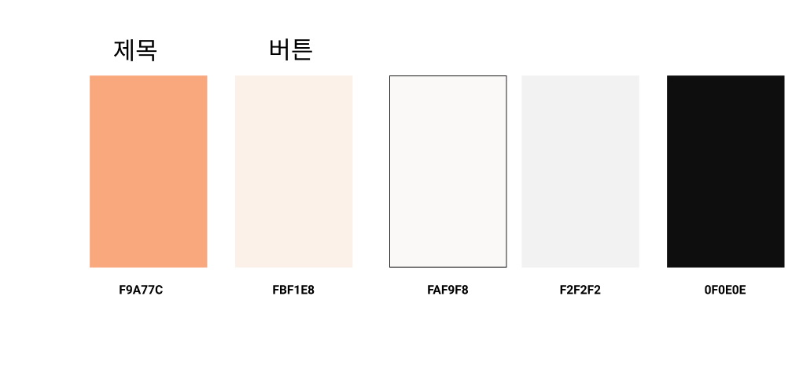

# FE 프로젝트 기획서

## 와이어프레임

## 컴포넌트 설계도

## 메인 컬러

## 변수명 스타일

1. 개별 컴포넌트 내의 일반 변수, 일반 함수명은 Camel Case를 사용한다. ex) userInfo
2. 컴포넌트명, 폴더명은 Pascal Case를 사용한다. ex) UserInfo

## Redux 구성

1. reducers, actions, types 폴더 및 파일을 만들어서 관리한다.
2. reducers폴더내에 index.js를 만들어서 모든 reducer를 combine 후 src/index.js로 보낸다.

## 하위 컴포넌트 관리

하위 컴포넌트가 생길 시 폴더로 함께 묶어서 관리한다.

ex) Login.js만 사용하다가 ---> LoginTemplate.js, LoginInput.js를 Login.js의 하위컴포넌트로 사용할시

​	  Login이라는 폴더에 Login.js, LoginTemplate.js, LoginInput.js 모두 모아준다.

## css 관리

하나의 .js파일에 하나의 .css 파일 각각 매칭해서 관리해준다.

## Commit 메세지 규칙

1. 기능구현시 : [S05P12C107-66] [FE-jhs9497] feat: A작업
2. 테스트 : [S05P12C107-66] [FE-jhs9497] test: A작업
3. 이슈완료시 : 스마트 커밋 .. 몰라요!

## Git flow 관리

1. labssafy 팀프로젝트 fork 해주기
2. 그 후 develop으로 로컬에 클론

- git clone -b develop --single-branch '**URL**'

1. 자기 아이디로 branch 따기

- git checkout -b jhs9497

1. git add .
2. git commit -m "[jira_task코드] [FE-ID] feat: 내용 "
3. gut push origin jhs9497

 7.(기능이완성 됐다면!! JIRA이슈 마무리 가능할 경우)
  jhs9497[내레포] -> develop[원본레포]로 PR 날리기!

- develop 반영을 위해서

1. git remote add upstrem "**URL**"
2. git fetch upstream // 정보 반영
3. git checkout develop
4. git branch -D jhs9497
5. git rebase upstream/develop

## PWA 만들기

PWA  == Progressvie Web App

1. 첫 프로젝트 만들 때 npx create-react-app 프로젝트명 --template cra-template-pwa 
2. index.js 하단에 serviceWorkderResitration.unregister(); ---> serviceWorkderResitration.register();
3. yarn build 
4. github 접속
5. new레포지 만들면서 레포지네임을 username.github.io라고 설정 
6. 레포지에 build폴더 내부의 파일들 전부 드래그 앤 드롭..! 엥 이게되네 ㅋㅋㅋㅋㅋ commit 클릭
7. 10분 뒤에 https://jhs9497.github.io로 들어가면 됨!

## 초기설정

- PWA 가능한 프로젝트 생성:
  - npx create-react-app 프로젝트명 --template cra-template-pwa 
- npm, yarn 설치:
  - npm install
  - npm install --global yarn
- 부트스트랩 설치:
  - npm install react-bootstrap bootstrap@4.6.0
    - react bootstrap 사이트의 CSS link 태그를 public - index.html에 복붙 (조금 더 안정적임)
    - 또는 index.js에 import "bootstrap/dis/css/bootstrap.min.css" 해주기
- 라우터 설치:
  - yarn add react-router-dom
  - import { Link, Route, Router } from 'react-router-dom';
- axios 설치:
  - yarn add axios
  - import axios from 'axios';
- redux 설치:
  - yarn add redux react-redux 
  - import { useDispatch, useSelector } from 'react-redux';
- react 아이콘 설치:
  - yarn add react-icons
  - import { MdDelete } from 'react-icons/md';